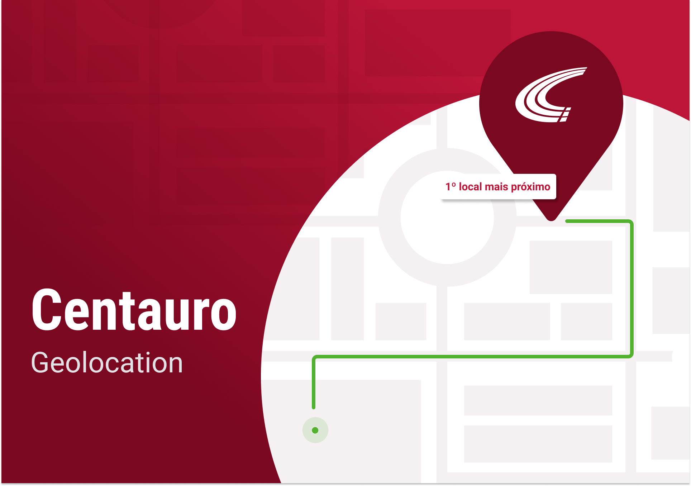
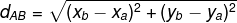
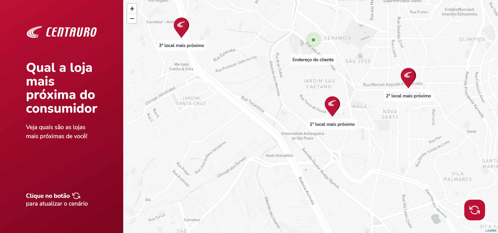

<h1 align="center">
  
</h1>

<p align="center">
  
  
  <a href="https://www.linkedin.com/in/luiz-araujojr/">
    
  </a>
  <a href="https://github.com/luiz-araujo/geolocation/blob/master/LICENSE">
    
  </a>
</p>

<p align="center">
  <a href="#geolocation">Geolocation </a>&nbsp;&nbsp;&nbsp;|&nbsp;&nbsp;&nbsp;
  <a href="#project">Project</a>&nbsp;&nbsp;&nbsp;|&nbsp;&nbsp;&nbsp;
  <a href="#layout">Layout</a>&nbsp;&nbsp;&nbsp;|&nbsp;&nbsp;&nbsp;
  <a href="#how-to-run">How to run</a>&nbsp;&nbsp;&nbsp;|&nbsp;&nbsp;&nbsp;
  <a href="#built-with">Built with</a>&nbsp;&nbsp;&nbsp;|&nbsp;&nbsp;&nbsp;
  <a href="#how-to-contribute">How to contribute</a>&nbsp;&nbsp;&nbsp;|&nbsp;&nbsp;&nbsp;
  <a href="#license">License</a>&nbsp;&nbsp;&nbsp;|&nbsp;&nbsp;&nbsp;
  <a href="#get-in-touch">Get in touch!</a>
</p>

## Geolocation

Geolocation is an application that visually demonstrates the 3 stores closest to a given coordinate.
The intention is that a customer who made a purchase through website and wants to withdraw the product in the store, knows what are the closest options.

## Project

Think of the following scenario:
A store offers its customers the opportunity to buy a product on the website and pick it up at the store. As we know the geographic location of the customer and also the location of the stores, we would like to have a technological solution that calculates the nearest stores for the customer to withdraw their product.

Considering an X, Y plane of size MxN, in which the user will be in a certain coordinate and the stores in other coordinates, create an algorithm that is able to order the stores by the shortest distance and bring the 3 stores closer together.

As inputs to the algorithm, consider the following parameters:

customerPosition = [X, Y], where the input is a vector of integers;
stores = \[[X, Y] ... [Xn, Yn]], where the entry is a 2xN matrix of integers;
plane = [M, N], where the input is a vector of integers.

0 ≤ X ≤ M
0 ≤ Y ≤ N
0 ≤ M ≤ 1000
0 ≤ N ≤ 1000

**Example**

customerPosition = [20, 32],
stores = \[[40.88], [18, 56], [99, 2]]
plan = [100,100]

**Expected outcome**

\[[18.56], [40.88], [99.2]]

Consider the following equation as a formula for calculating the distance between the customer and the stores:



## Layout



## How to run

#### Requirements

To clone and run the application you will need:

- [Git](https://git-scm.com)
- [Node](https://nodejs.org/)
- [Yarn](https://yarnpkg.com/)

From your command line:

```bash
# Clone this repository
$ git clone https://github.com/luiz-araujo/geolocation.git

# Go into the folder repository
$ cd geolocation

# Install dependencies
$ yarn install
```

### Mapbox Token

Before running the application you need to add an mapbox token, to create it access [Mapbox creation token](https://docs.mapbox.com/help/getting-started/access-tokens/#how-access-tokens-work) and get one.

Steps:
1 - Create an access token on the [Mapbox creation token](https://docs.mapbox.com/help/getting-started/access-tokens/#how-access-tokens-work) page
2 - Create a file called .env and add the token following the model below

```bash
# .env file
REACT_APP_MAPBOX_TOKEN=put_here_your_token
```

### Fake API

First of all, so that you have the data to display on screen, a file was created that you can use as a fake API to provide you with this data.

The project has a dependency called json-server listed in package.json, and a file called db.json that contains the data.

```bash
# To run this server you can run the following command:
$ yarn json-server
```

### Web

```bash
# in another tab of the terminal to run the app

# Run
$ yarn start

# running on port 3000
```

To start the application with a single command use the command below and the app will start fake api and web server simultaneously.

```bash
# Run json-server and run app
$ yarn dev
```

## Built With

- [NodeJS](https://nodejs.org/en/) - designed to build scalable network applications
- [ReactJS](https://reactjs.org/) - A JavaScript library for building user interfaces
- [TypeScript](https://www.typescriptlang.org/) - TypeScript is a typed superset of JavaScript that compiles to plain JavaScript.
- [Styled Components](https://styled-components.com/) - Help keep the concerns of styling and element architecture separated and make components more readable.
- [Leaflet](https://leafletjs.com/) - Leaflet is an open-source JavaScript library used for web mapping. The Leaflet library forms the basis of Mapbox.js.
- [Mapbox](https://www.mapbox.com/) - Maps and location for developers. Precise location data and powerful developer tools.
- [SWR](#) - SWR is a React Hooks library for data fetching. SWR first returns the data from cache (stale), then sends the fetch request (revalidate), and finally comes with the up-to-date data again.

## How to contribute

- Make a fork;
- Create a branch with your feature: `git checkout -b my-feature`;
- Commit changes: `git commit -m 'feat: My new feature'`;
- Make a push to your branch: `git push origin my-feature`.

After merging your receipt request to done, you can delete a branch from yours.

## License

This project is under the MIT license. See the [LICENSE](https://github.com/luiz-araujo/geolocation/blob/master/LICENSE) for details.

## Get in touch!

<a href="https://www.linkedin.com/in/luiz-araujojr/" target="_blank" >
  
</a>&nbsp;&nbsp;&nbsp;
<a href="mailto:luizcaj@yahoo.com.br" target="_blank" >
  
</a>

---

Made with ❤️ by Luiz Araújo.
